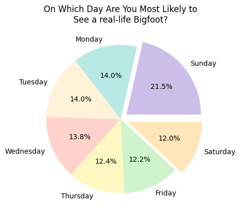
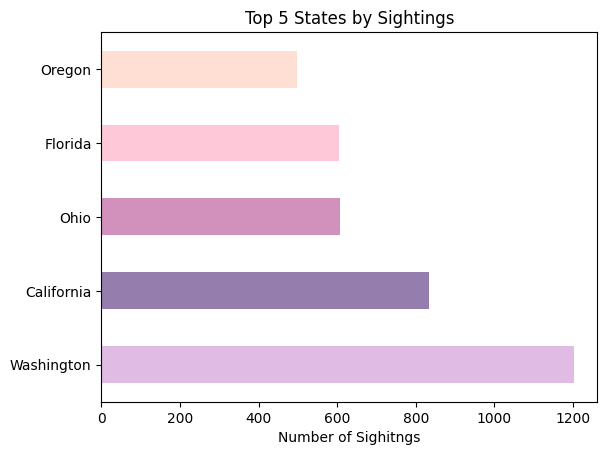
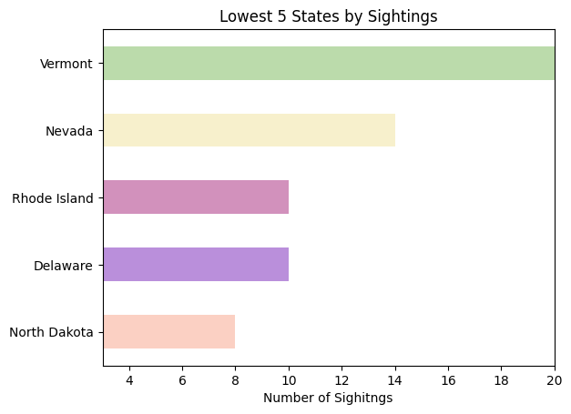

# Bigfoot Data Project


## The Mission Statement

This project is an attempt to assist the cryptozoology community in their hunt for the elusive and legendary creature- Bigfoot. 
With the data provided by eyewitness accounts, I have created visualizations that these intrepid explorers and hunters can use to ascertain 
the best conditions under which to go about the search. The tools provided here will enable us to search the best possible day, season, etc., 
to locate our subject. We will also explore sighitngs over several decades to answer the question, "Have sighitng amounts varied over the years?".
It is my hope that with this scientific and graphical analysis we can finally locate this rare and evasive cryptid and finally put to bed this 
age-old question. 

### Libraries Needed
```python
import pandas as pd
import numpy as np
import matplotlib.pyplot as plt
```

### Read in CSV code
```python
df = pd.read_csv('data_main/merged_data.csv').drop(columns=['count', 'observed','location_details', 'title', 'pressure', 'summary', 'uv_index', 'visibility', 'wind_bearing','wind_speed', 'temperature_mid', 'dew_point','humidity','cloud_cover','precip_intensity','precip_probability','precip_type', 'latitude', 'longitude', 'geohash'])	
```


### Cleaning File

```python
df.head(10)
df.tail(5)
```

The above code allows us to make sure it's reading our entire document. When you return this text it looks like a mess for the head. Columns B and C, 'observed' and 'location_details' respectively contain text descriptions, basically anecdotes about what was seen and what the scene looked like. These columns are dropped from the dataframe as they hae no use for our purposes. This was done in the first instance of reading the csv via .drop(columns=) 


##### df.head(10)
```python
	county	state	season	day_of_the_week	date	year	temperature_high	temperature_low	moon_phase
0	Winston County	Alabama	Summer	Wednesday	10-Nov	2021.0	NaN	NaN	1.00
1	Valdez-Chitina-Whittier County	Alaska	Fall	Saturday	23-Nov	2021.0	NaN	NaN	0.99
2	Washington County	Rhode Island	Fall	Sunday	23-Nov	2021.0	78.17	68.68	0.99
3	York County	Pennsylvania	Summer	Monday	23-Nov	2021.0	NaN	NaN	0.99
4	Yamhill County	Oregon	Spring	Sunday	23-Nov	2021.0	NaN	NaN	0.99
5	Washita County	Oklahoma	Fall	Monday	23-Nov	2021.0	71.86	50.99	0.99
6	Washington County	Ohio	Summer	Monday	23-Nov	2021.0	NaN	NaN	0.99
7	Westchester County	New York	Fall	Saturday	23-Oct	2021.0	92.24	69.38	0.99
8	Washoe County	Nevada	Fall	Saturday	23-Oct	2021.0	NaN	NaN	0.99
9	Warren County	New Jersey	Fall	Friday	23-Oct	2021.0	NaN	NaN	0.99
```
 
##### df.tail(5)
```python
	county	state	season	day_of_the_week	date	year	temperature_high	temperature_low	moon_phase
14751	Rio Arriba County	New Mexico	Summer	NaN	NaN	NaN	NaN	NaN	NaN
14752	Prince George's County	Maryland	Spring	NaN	NaN	NaN	NaN	NaN	NaN
14753	Lake County	Florida	Summer	NaN	NaN	NaN	NaN	NaN	NaN
14754	White County	Illinois	Fall	NaN	NaN	NaN	NaN	NaN	NaN
14755	Calhoun County	Illinois	Summer	NaN	NaN	NaN	NaN	NaN	NaN
```


### Getting county information
```python
df['county'].describe()
```

```python
count             10042
unique             1037
top       Pierce County
freq                152
Name: county, dtype: object
```

### Using functions from the statistics module to get information
```python
df['temperature_high'].mean()
67.11769322947873
```

```python
df['temperature_low'].mean()
48.63876763875823 
```


```python
#Data Project Requirements 
1.) Loaded in my csv data with pandas 
2.) Used .drop() in the context of the original CSV read to remove unwanted columns
3.) Use df.head and tail to ensure entire file is read wihtout unwanted information
4.) Used nsmallest() and nlargest() to target specific values
5.) Used the .drop() funciton to clean data in second visualization, eliminating Unknown values
6.) .describe() used to pull information relating to county column 
7.) used .mean() to analyze average high and low temperatures
```


# The Visuals 

### Analysis
This pie chart shows us that you are scientifically most likely to encounter Bigfoot on a Sunday. Presently we are unsure whether to interpret 
this as a consequence of any religious affiliation that the mysterious crypitd might have, but with more studies that may be determined. Saturday
is the day you are least likely to encounter such a creature. This may be due to any number of factors, but we suspect self-care is a common practice
in the sasquatch community. 


###  Analysis 
This bar chart attempts to show, in wonderful pastel colors, during which season Bigfoot is most likely to be spotted. It appears from our rigorous 
collection and analysis that this is most likely to occur in the Summer months. Based on this research, it is likely that Bigfoot is a "Sun's out, guns out' 
type of guy, a proper chill dude. The winter is the least likely month to spot one of these guys. The only logical possible explanation for this is that Bigfoot
sleeps through most of this time like a bear or something. 


### Analysis 
This area graph displays the frequency of sightings over the years. We have data going back to the 19th century, but the bulk of it is from the last 70 or so years. 
This chart seems to say that sightings peaked in the mid 2000's and has fallen since then. The 60's to the 90's show a steady increase in sightings. By the 2010's Bigfoot is 
becoming more difficult to glimpse than the decade prior. The 2020's have seen a return to 90's level encounters. It is speculated that the Sars-CoV-2 pandemic early in this decade 
contributed to scarcity of sighitngs. Professional social-distancers, Sasquatch populations likely were unaffected by the global health emergency. 



### Analysis
This chart gives us the most popular states for Bigfoot viewing. The pacific nortwest seems to be a very well-represented region. We have the forests of Washington state in the top spot. Interestingly, Ohio is third most popular, an area that we don't necesserially associate with Bigfoot in the popular imagination. Floida's Skunkape is a Bigfoot variation many don't know about outside the region. This 
version of the cryptid is often said to be sighited in the many bogs and swamps of the American southeast. 



### Analysis
This chart shows us the states where you're least likely to encounter a Sasquatch. Don't buy a plane ticket to North Dakota is you're on the hunt. Of the least represented states, Vermont is your best option, but don't waste your time. 