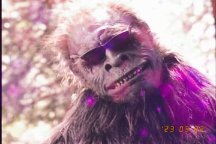

# bigfoot_sightings data visualizations. 

## data relating to eye witness accounts of 'squatches and otherwise hairy or out-of-focus bipeds 

### The Mission Statement

This project is an attempt to assist the cryptozoology community in their hunt for the elusive and legendary creature- Bigfoot. 
With the data provided by eyewitness accounts, I have created visualizations that these intrepid explorers and hunters can use to ascertain 
the best conditions under which to go about the search. The tools provided here will enable us to search the best possible day, season, etc., 
to locate our subject. We will also explore sighitngs over several decades to answer the question, "Have sighitng amounts varied over the years?".
It is my hope that with this scientific and graphical analysis we can finally locate this rare and evasive cryptid and finally put to bed this 
age-old question. 